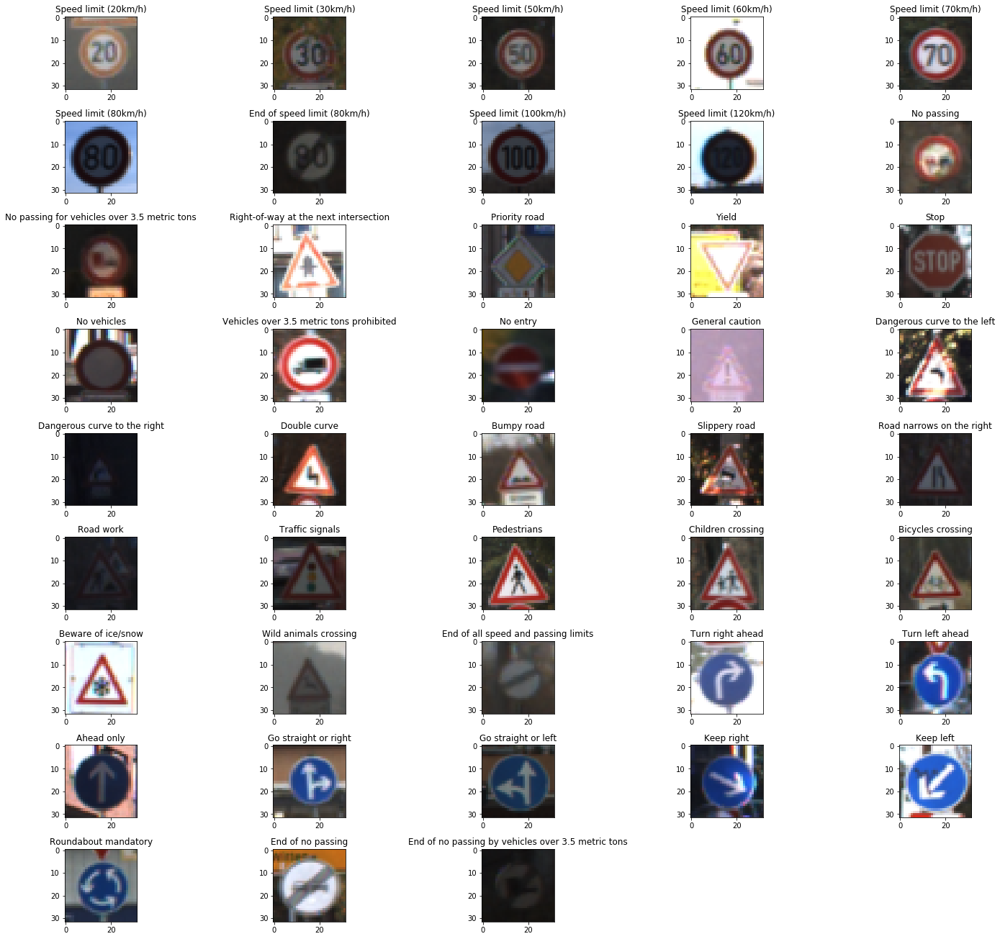

## Project: Build a Traffic Sign Recognition Program

My submission for term 1 project 1, see [P1.ipynb](https://github.com/shunjilin/UdacityCarNDTrafficSignClassifier/blob/master/Traffic_Sign_Classifier.ipynb) for implementation and [writeup.md](https://github.com/shunjilin/UdacityCarNDTrafficSignClassifier/blob/master/writeup.md) for details.

Overview
---
In this project, you will use what you've learned about deep neural networks and convolutional neural networks to classify traffic signs. You will train and validate a model so it can classify traffic sign images using the [German Traffic Sign Dataset](http://benchmark.ini.rub.de/?section=gtsrb&subsection=dataset). After the model is trained, you will then try out your model on images of German traffic signs that you find on the web.

